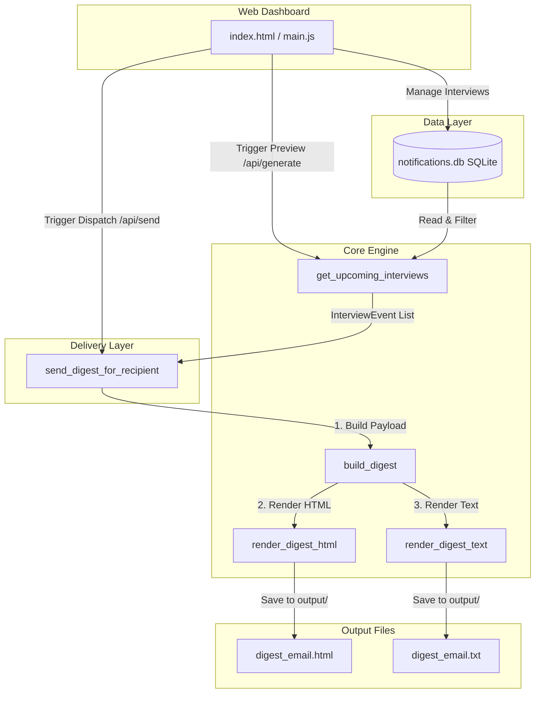

# Digest Notifications

<p align="left">
  
  
  
  
  
</p>

An automated, lightweight batching module designed to reduce notification fatigue by summarizing upcoming interview events into a single daily or weekly email digest instead of sending multiple separate notification emails.

---

## 💡 What the Project Does

This project provides an automated backend engine and an interactive web control room to solve notification fatigue in recruitment workflows. It performs the following operations:

1. **Gathers & Filters Data**: Reads mock scheduled interviews from a SQLite database (`data/notifications.db`) and filters for upcoming events (on or after a selected reference date).
2. **Batch Capping**: Enforces a strict batch size limit (default: **5 interviews**) to keep digest emails concise and readable.
3. **Chronological Grouping**: Groups the upcoming interviews under calendar date headers and sorts them chronologically by time within each day.
4. **Dual-Format Compilation**: Compiles the grouped interviews into a premium, responsive **HTML email layout** (via Jinja2) and a clean **plain-text fallback** layout (improving email deliverability scores).
5. **Interactive Web Dashboard**: Spawns a local HTTP server hosting a dark-mode dashboard where recruiters can:
   - Schedule new mock interviews or delete existing ones.
   - Select daily or weekly schedules and reference dates.
   - Instantly render and preview HTML and plain-text outputs.
   - Log dispatches to a audit log database table (`sent_logs` in `notifications.db`).

---

## 📐 Architecture Flow



---

## 📁 Project Structure

```
Digest-Notifications/
├── .gitignore                      # Git control exclusions
├── README.md                       # Comprehensive documentation
├── requirements.txt                # External dependencies (Jinja2)
├── data/
│   ├── notifications.db            # SQLite database file storing interviews and sent logs
│   ├── interviews.json             # Legacy JSON database (retained for fallback/migration)
│   └── sent_logs.json              # Legacy JSON history log (retained for fallback/migration)
├── output/
│   ├── digest_email.html           # Generated HTML email body
│   └── digest_email.txt            # Generated plain-text fallback body
├── src/
│   ├── digest.py                   # CLI controller & HTTP REST APIs
│   ├── database.py                 # Database setup and connection helper
│   ├── migrate.py                  # Database one-time migration utility
│   ├── models.py                   # Plain data models (InterviewEvent, DigestRecipient, etc.)
│   ├── digest_builder.py           # Chronological date-bucketing logic
│   ├── renderer.py                 # Jinja2 HTML & plain-text compilation
│   ├── sender.py                   # Provider-agnostic batch dispatch interfaces
│   ├── templates/
│   │   └── digest_template.html    # Premium responsive HTML email template
│   └── web/
│       ├── index.html              # Web Dashboard HTML
│       └── main.js                 # Web Dashboard JS
└── tests/
    ├── benchmark_digest_pipeline.py # Manual pipeline timing & performance benchmark
    └── test_digest_notifications.py # Consolidated unit & integration test suite (19 tests)
```

---

## 🚀 Getting Started

### 1. Prerequisites
Ensure you have **Python 3.8+** installed.

### 2. Installation
Install the required dependency (Jinja2):
```bash
pip install -r requirements.txt
```

### 3. Run the Test Suite
# Execute the consolidated verification tests:
```bash
python tests/test_digest_notifications.py
```

### 4. Run the Performance Benchmark (optional)
# Reproduce the pipeline timing/output-size figures quoted in the project report:
```bash
python tests/benchmark_digest_pipeline.py
```
Optional flags: `--runs N` (default 200) and `--ref-date YYYY-MM-DD` (default 2026-06-27). This is a manual benchmarking script, not part of the automated test suite -- it measures wall-clock time for each pipeline stage against the current mock dataset, on a single process, on whatever machine it's run on. See the script's docstring for caveats.

### 5. Run the Web Dashboard Control Panel
To open the interactive dashboard control room:
```bash
python src/digest.py --serve --port 8000
```
Then navigate to **http://localhost:8000** in your browser.

### 6. Migrate Legacy JSON Data (optional)
If you have legacy database JSON files (`data/interviews.json` and `data/sent_logs.json`) containing existing schedules/logs, you can migrate them into the SQLite database file:
```bash
python src/migrate.py
```
*Note: The engine automatically attempts a one-time migration of legacy JSON data on its initial startup if the SQLite tables are empty.*

---

## 💻 CLI Usage

Use the command line interface to trigger digest generation manually or in a cron job:

```bash
# Generate a Daily digest (default) — includes interviews for today only
python src/digest.py --cli --type daily

# Generate a Weekly digest — includes interviews within the next 7 days
python src/digest.py --cli --type weekly --ref-date 2026-06-27
```

> [!NOTE]
> **Date-window scoping**: `--type daily` includes interviews on `ref_date` only (1-day window). `--type weekly` includes interviews between `ref_date` and `ref_date + 7 days`. Interviews outside this window are excluded regardless of how many exist.

**CLI Output (JSON stdout):**
```json
{
  "status": "success",
  "digest_type": "daily",
  "reference_date": "2026-06-27",
  "date_range": "June 27, 2026",
  "interviews_count": 5,
  "total_upcoming_count": 12,
  "batch_size_limit": 5,
  "output_html": "output/digest_email.html",
  "output_text": "output/digest_email.txt"
}
```

> [!NOTE]
> When `total_upcoming_count > interviews_count`, the digest was capped by the batch size limit. The digest email itself will display a **"Showing X of Y upcoming interviews"** notice.

## ⏰ Automated Scheduling (Cron Setup)

You can configure automated digest generation and dispatch by running the engine with the `--cron` flag. This will automatically build the digest payload, generate output files, dispatch emails, and update the sent audit logs database.

```bash
# Trigger automated Daily digest generation & dispatch
python src/digest.py --cron --type daily

# Trigger automated Weekly digest generation & dispatch
python src/digest.py --cron --type weekly
```

### Recommended Cadence Setup

#### 1. Daily Digest
Daily digests summarize tomorrow's upcoming interviews. Running this at **17:00 (5:00 PM)** daily allows recruiters to review tomorrow's schedule at the end of their current workday.

Add the following to your system's crontab (`crontab -e`):
```cron
# Run daily digest generation and dispatch at 5:00 PM every day
0 17 * * * cd /path/to/project && python src/digest.py --cron --type daily
```

#### 2. Weekly Digest
Weekly digests summarize the upcoming week's interviews. Running this on **Monday mornings at 08:00 AM** provides a weekly agenda overview at the start of the week.

Add the following to your system's crontab:
```cron
# Run weekly digest generation and dispatch at 8:00 AM every Monday
0 8 * * 1 cd /path/to/project && python src/digest.py --cron --type weekly
```

---

## 🔌 Developer Integration Guide

> [!NOTE]
> The integration examples below (like real SendGrid/SES email dispatch or external database synchronization) are **not implemented directly inside this standalone project**. This repository functions as a self-contained simulation module. However, the codebase is designed to be easily dropped into the main Orchestrator project using the interface patterns shown below.

### 1. Programmatic Compilation
To compile a digest programmatically in your main services:

```python
import datetime
from models import DigestRecipient, InterviewEvent, DigestFrequency
from digest_builder import build_digest
from renderer import render_digest_html, render_digest_text

# 1. Define recipient
recipient = DigestRecipient(
    user_id="user-456",
    email="recipient@example.com",
    display_name="Sarah Connor",
    frequency=DigestFrequency.DAILY,
)

# 2. Package events
interviews = [
    InterviewEvent(
        interview_id="int-101",
        candidate_name="Alex Rivera",
        role_title="Backend Engineer",
        interviewer_name="Thomas Anderson",
        scheduled_at=datetime.datetime(2026, 7, 1, 10, 0),
    )
]

# 3. Compile assets
payload = build_digest(recipient, interviews)
unsubscribe_url = "https://example.com/unsubscribe?user_id=user-456"

html_body = render_digest_html(payload, unsubscribe_url=unsubscribe_url)
text_fallback = render_digest_text(payload, unsubscribe_url=unsubscribe_url)
```

### 2. Custom Email Provider (SES / SendGrid)
To send digests via a real provider in your host project, implement the `EmailSenderProtocol` interface contract and pass the adapter to the sender:

```python
from sender import EmailSenderProtocol, send_digest_for_recipient


class MySendGridAdapter(EmailSenderProtocol):
    def send_html_email(self, to_email: str, subject: str, html_body: str) -> dict:
        # Plug in your SendGrid client library code here
        return {"status": "sent", "provider": "sendgrid"}


# Dispatch
result = send_digest_for_recipient(
    recipient=recipient,
    interviews=interviews,
    email_sender=MySendGridAdapter(),
    unsubscribe_base_url="https://example.com",
)
```

### 3. Docker Compose Service Integration
To run the digest engine as an autonomous service inside the parent orchestrator's Docker Compose environment, add the following service definition to the root `docker-compose.yml`:

```yaml
  digest-notifications:
    build:
      context: .
      dockerfile: Dockerfile
    container_name: ai-interview-digest-notifications
    ports:
      - "8080:8080"
    environment:
      ${API_TOKEN:?API_TOKEN must be set}
      DIGEST_BATCH_SIZE: "5"
    volumes:
      - .:/app
    networks:
      - ai-interview-network
    working_dir: /app/Digest-Notifications
    command: python src/digest.py --serve --port 8080 --host 0.0.0.0
    restart: unless-stopped
    deploy:
      resources:
        limits:
          memory: 512M
          cpus: "1.0"
```

Once defined, build and launch the service:
```bash
docker compose up -d --build digest-notifications
```
The dashboard control room will then be exposed securely on host port `8080` (accessible at `http://localhost:8080`).

## 📡 REST API Reference

### POST /api/interviews — Schedule an Interview
Creates a new interview entry. All fields are required; `date` and `time` are validated at creation time.

```json
{
  "candidate_name": "Alex Rivera",
  "role": "Backend Engineer",
  "interviewer_name": "Sarah Connor",
  "date": "2026-07-15",
  "time": "10:30",
  "meeting_link": "https://meet.example.com/abc",
  "location": "Room 3B"
}
```

| Field | Format | Required |
|-------|--------|----------|
| `date` | `YYYY-MM-DD` | ✅ Yes |
| `time` | `HH:MM` (24-hour) | ✅ Yes |
| `meeting_link` | URL string | ❌ Optional |
| `location` | String | ❌ Optional |

Malformed `date` or `time` values are rejected immediately with a `400 Bad Request` — they are never stored.

### GET /api/interviews — List Interviews (Paginated)
```
GET /api/interviews?limit=10&offset=0
```
| Parameter | Default | Description |
|-----------|---------|-------------|
| `limit` | `10` | Max records to return |
| `offset` | `0` | Number of records to skip |

Response: `{ "interviews": [...], "total": 42, "limit": 10, "offset": 0 }`

### GET /api/logs — List Dispatch Logs (Paginated)
```
GET /api/logs?limit=10&offset=0
```
Same `limit`/`offset` parameters as above. Logs are returned newest-first.

Response: `{ "logs": [...], "total": 18, "limit": 10, "offset": 0 }`

---

## 🔒 Security Model

### 1. Loopback-Only Binding (Default)
By default, the dashboard HTTP server binds to the local loopback interface (`127.0.0.1`), ensuring it is only accessible from your local machine.

To expose the dashboard on other interfaces (e.g. for access on a shared network or container), explicitly specify the `--host` flag:
```bash
python src/digest.py --serve --host 0.0.0.0 --port 8080
```

### 2. Mutation Endpoint Authentication
All state-mutating HTTP requests (`POST` and `DELETE` endpoints) require authentication via an API token header.
* Include the token in the `X-API-Token` request header.
* The expected token is read from the `API_TOKEN` environment variable (defaults to `api123` if not set).
* Unauthenticated requests are rejected with a `401 Unauthorized` response.

### 3. CORS Policy
The `Access-Control-Allow-Origin: *` wildcard header has been **removed**. The dashboard is served from the same origin as the API, so no cross-origin header is needed. This prevents third-party websites from silently issuing requests against the local API through a victim's browser.

### 4. Safe Error Responses
Internal exceptions are **never** surfaced to API clients as raw stack traces. All `500` responses return only a generic message plus a unique Error ID for server-side log correlation:
```json
{ "status": "error", "message": "An internal server error occurred. Please contact the administrator with Error ID: a1b2c3d4." }
```

---

*Made with ❤️ by [Dhanish Ladwani](https://github.com/dhanish0711)*
