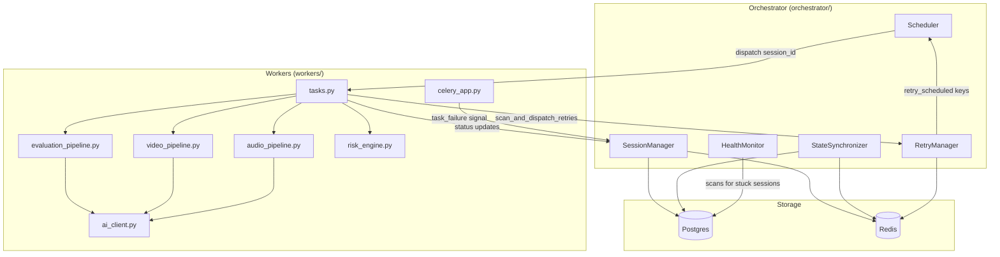
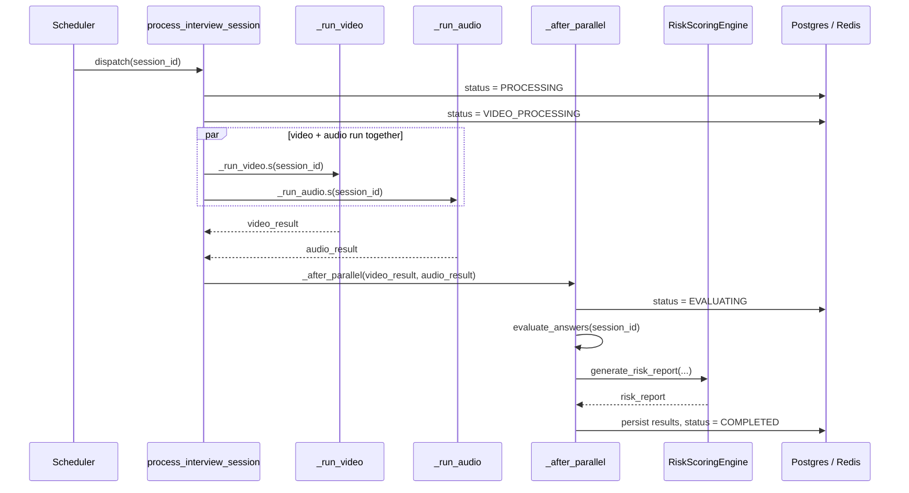
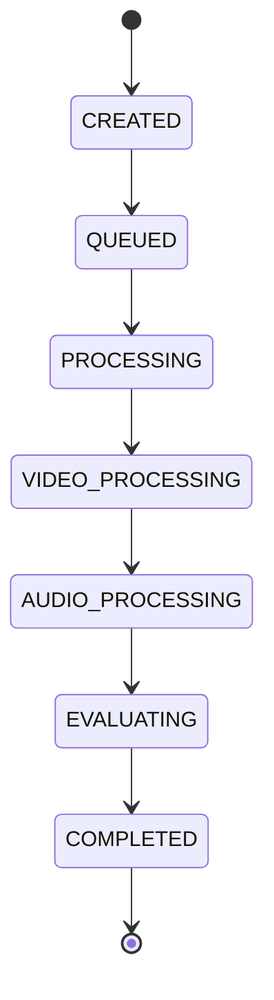
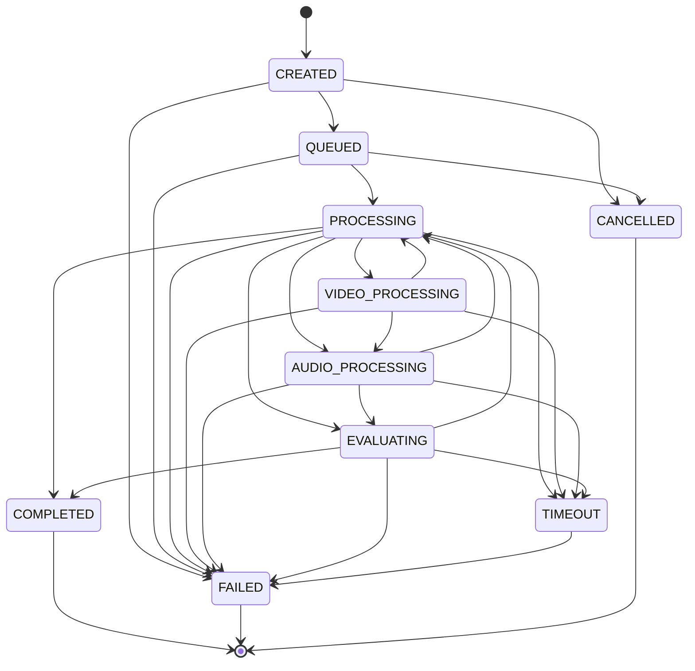
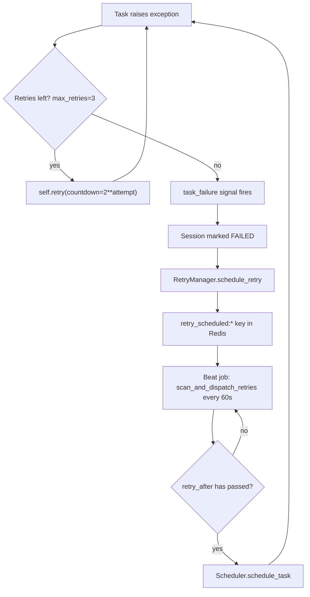
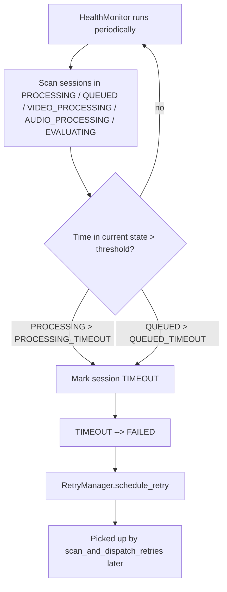
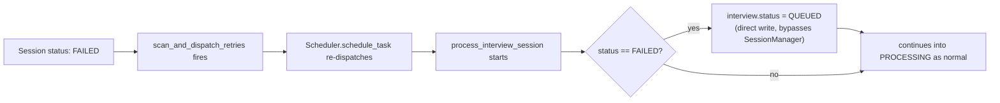

# Workers

This folder holds the Celery worker code that actually runs an interview
session: video analysis, audio analysis, answer evaluation, and risk
scoring. If you're trying to understand how a session moves from "just
submitted" to "here's the risk report," this is the place to look.

## What's in here

- `celery_app.py` – Celery app + broker/backend setup, plus the
  `task_failure` signal that marks a session `FAILED` only once retries run
  out.
- `tasks.py` – the actual task graph: `process_interview_session`,
  `_run_video`, `_run_audio`, `_after_parallel`, and the beat job
  `scan_and_dispatch_retries`.
- `video_pipeline.py`, `audio_pipeline.py`, `evaluation_pipeline.py` – the
  three analysis stages.
- `risk_engine.py` – combines all three stage outputs into a final risk
  score/report.
- [`docs/integrity-score-schema.md`](../docs/integrity-score-schema.md) –
  canonical anti-cheat `integrity_score` contract shared by backend and
  frontend.
- `ai_client.py` – shared client the pipelines use to talk to the AI
  provider.
- `worker_agent.py` / `worker_entrypoint.py` – how a worker process boots.
- `_stubs.py` – fakes used for local/test runs.

Session state itself isn't owned here — it lives in
[`SessionManager`](../orchestrator/session_manager.py), synced across
Postgres and Redis by [`StateSynchronizer`](../orchestrator/state_sync.py).
This code just calls into that.

## How this folder fits into the rest of the system



Nothing in `workers/` talks to Postgres or Redis directly except through
`SessionManager` — the pipelines themselves (`video_pipeline.py`,
`audio_pipeline.py`, `evaluation_pipeline.py`) are mostly stateless, they
just get a `session_id`, do their analysis, and hand a dict back up to
`tasks.py`.

## How a session actually flows through this

`process_interview_session` is the one entry point the
[`Scheduler`](../orchestrator/scheduler.py) calls. Roughly:

1. If the session was previously `FAILED`, it gets reset to `QUEUED` for
   another go.
2. Session flips to `PROCESSING`, worker hostname gets recorded.
3. Session flips to `VIDEO_PROCESSING`, and video + audio analysis run at
   the same time as a Celery `group` (they don't depend on each other, so
   no reason to run them sequentially).
4. Once both come back, `_after_parallel` takes over: marks the session
   `EVALUATING`, runs answer evaluation, then risk scoring, then writes
   everything to Postgres and marks it `COMPLETED`.
5. If `process_interview_session` throws anywhere, it calls `self.retry(...)`
   with a backoff of `2 ** attempt` seconds, up to 3 attempts. Note that the
   session is **not** immediately marked `FAILED` on an exception — that only
   happens once Celery gives up, via the `task_failure` signal in
   `celery_app.py`.
6. Separately, `scan_and_dispatch_retries` runs every 60s (Celery Beat),
   checks Redis for anything whose scheduled retry time has passed, and
   re-dispatches it through the Scheduler.

Here's the same thing as a sequence diagram, since the parallel step trips
people up the most:



## State machine

First, the path a session actually takes in normal operation — this is
what `process_interview_session` and `_after_parallel` walk every time,
with no exceptions and no retries:



Now here's the full picture — every transition the
*validator* allows, per `SessionManager.VALID_TRANSITIONS`. It's a lot
busier than the happy path above because the validator is more permissive
than the code that actually runs: it allows things like resuming from
`EVALUATING` back to `PROCESSING`, or `QUEUED` jumping straight to
`VIDEO_PROCESSING`, that `tasks.py` never actually exercises today. Treat
this one as "what's technically legal," not "what commonly happens":



A quick word on each state, and who's responsible for setting it:

- **CREATED** – session row exists, nothing has happened yet
  (`SessionManager.create_session`).
- **QUEUED** – sitting in line for a worker (`Scheduler`).
- **PROCESSING** – a worker has picked it up and is about to start the
  actual stages (`process_interview_session`).
- **VIDEO_PROCESSING** – video + audio are running in parallel; this is the
  status shown while both are in flight (`process_interview_session`).
- **AUDIO_PROCESSING** – part of the same valid-transition set for the
  audio side; in practice video and audio run together under one
  `VIDEO_PROCESSING` status update (`session_manager.py`).
- **EVALUATING** – both analysis stages are done, now scoring the answers
  and building the risk report (`_after_parallel`).
- **COMPLETED** – terminal, risk report is saved (`_after_parallel`).
- **FAILED** – terminal, either retries got exhausted or something broke
  post-parallel (`celery_app.py`'s `task_failure` handler, or
  `_after_parallel`'s except block).
- **TIMEOUT** – a stage took too long and `HealthMonitor` flagged it; always
  rolls into `FAILED` next.
- **CANCELLED** – terminal, session was cancelled before it ever got picked
  up (`SessionManager`).

## Retries, failures, timeouts

There are actually two layers of retry logic and it's easy to conflate
them:

- **Task-level retries** — plain Celery retry with exponential backoff,
  handled inside `process_interview_session`, `_run_video`, `_run_audio`
  (`max_retries=3`, delay = `2 ** attempt` seconds).
- **Session-level retry bookkeeping** — `RetryManager` tracks attempt counts
  and schedules a retry time in Redis; `scan_and_dispatch_retries` is what
  actually notices that time has passed and kicks the session back into the
  scheduler.



Stuck sessions (stuck, not failed — e.g. a worker died mid-task) are caught
separately by `HealthMonitor.detect_stuck_sessions`, using the
`PROCESSING_TIMEOUT` / `QUEUED_TIMEOUT` thresholds defined on
`SessionManager`. That path looks like this:



This is a separate mechanism from the Celery-level retry in
`process_interview_session` — that one fires from inside the task when an
exception is raised. `HealthMonitor` instead catches the case where nothing
raised an exception at all; the worker process just died, got OOM-killed,
or lost its connection, and the session is left sitting in a
non-terminal state with nobody actively working on it.

## Gotcha: FAILED isn't actually terminal

The state diagram above shows `FAILED` with no way out, because that's what
`SessionManager.VALID_TRANSITIONS` says. In practice there's a bypass, right
at the top of `process_interview_session`:

```python
if interview.status == "FAILED":
    interview.status = "QUEUED"
    db_session.commit()
```

`scan_and_dispatch_retries` doesn't check a session's current status before
re-dispatching it — it just reads `retry_scheduled:*` keys from Redis and
fires the session_id back into the `Scheduler` once the retry time has
passed. So when the task runs again, Postgres may still say `FAILED`, and
this line quietly flips it back to `QUEUED` and carries on — bypassing
`session_manager.update_session_status()` entirely (no validation, no
Redis sync through the normal path, just a direct write).



Two things worth knowing if you're touching this code:

- This reset doesn't check `RetryManager`'s attempt count or the Celery-level
  `self.request.retries` counter — they're separate tallies from this check.
  Anything that re-dispatches a `FAILED` session_id (a bug, a manual retry,
  a duplicate beat tick) gets it un-failed with no extra gate.
- If you're debugging "why did this failed session start processing again
  with no obvious retry log," this is the line to check first.

## Where to look next

- [`orchestrator/session_manager.py`](../orchestrator/session_manager.py) — source of truth for state transitions.
- [`orchestrator/state_sync.py`](../orchestrator/state_sync.py) — Postgres/Redis sync.
- [`orchestrator/scheduler.py`](../orchestrator/scheduler.py) — how sessions get dispatched to workers.
- [`orchestrator/retry_manager.py`](../orchestrator/retry_manager.py) — retry attempt tracking + backoff scheduling.
- [`orchestrator/health_monitor.py`](../orchestrator/health_monitor.py) — timeout/stuck-session detection.
- [`monitoring/dashboard.html`](../monitoring/dashboard.html), [`monitoring/metrics_collector.py`](../monitoring/metrics_collector.py) — live view of what's happening.
- [Celery docs](https://docs.celeryq.dev/en/stable/) — for the retry/group/beat mechanics referenced above.
